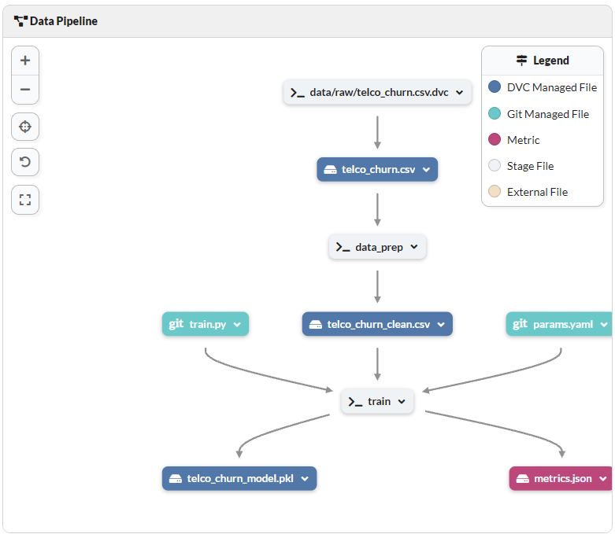
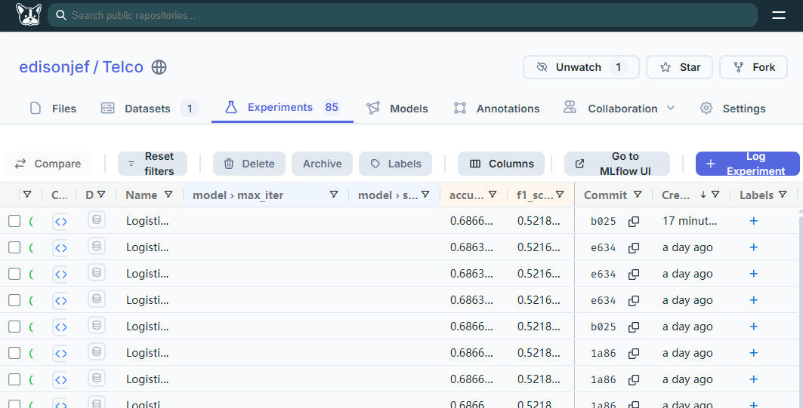
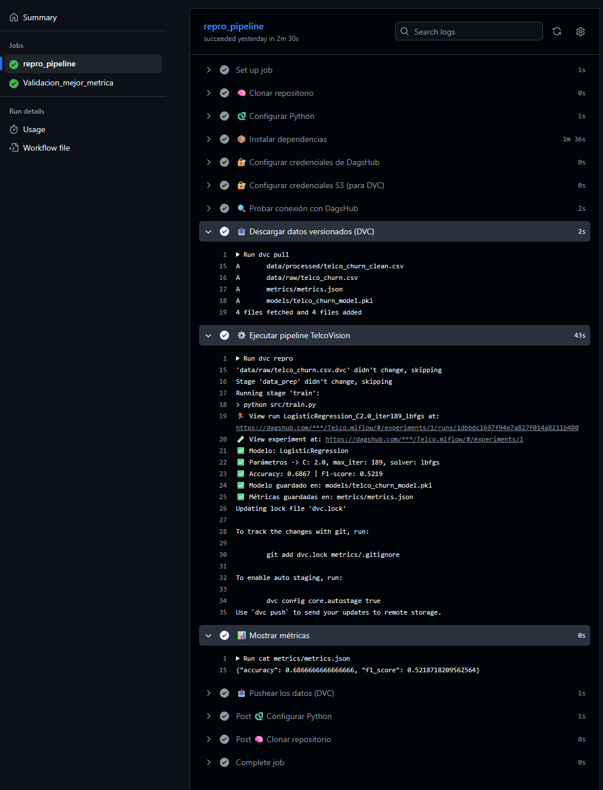
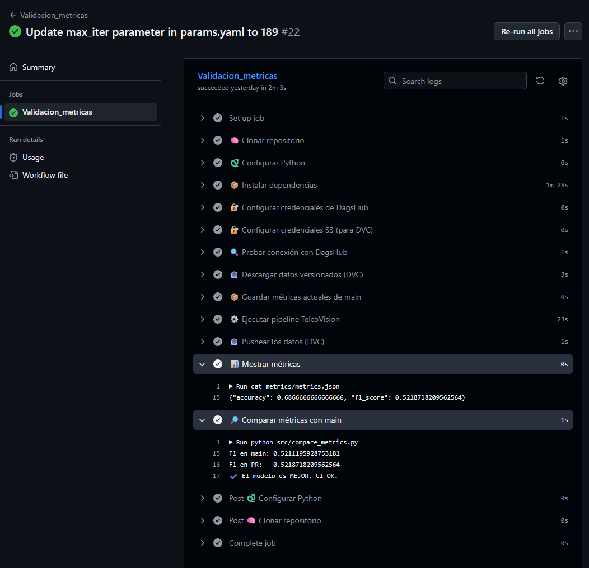
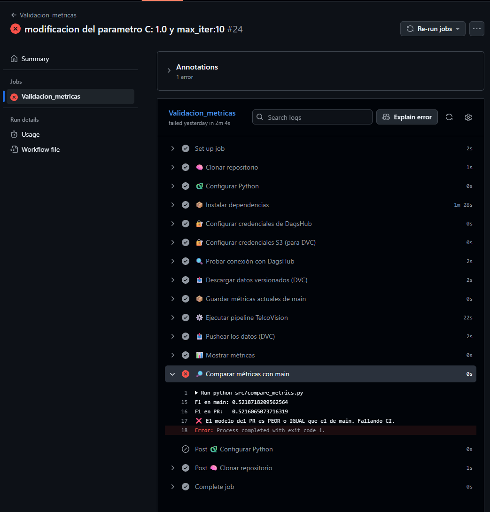

# 📡 TelcoVision — Documentación del Proyecto (Etapas 1 a 6)



## 1. Introducción
El presente proyecto forma parte de la materia **Laboratorio de Minería de Datos** del Instituto ISTEA y tiene como objetivo reproducir el flujo de trabajo real de un equipo de **MLOps** dedicado al desarrollo de modelos predictivos. La empresa ficticia **TelcoVision**, dedicada a servicios de telecomunicaciones, busca reducir su tasa de **churn** (clientes que se dan de baja). Para ello se provee un dataset de 10.000 clientes con información demográfica, contractual y de uso de servicios.

El proyecto consiste en construir un **pipeline reproducible de Machine Learning** utilizando:
- Versionado de datos con **DVC**
- Control de experimentos (DVC Experiments / MLflow)
- Automatización de CI/CD con **GitHub Actions**
- Sincronización de código y datos con **DagsHub**
- Trabajo colaborativo mediante ramas y Pull Requests

Se siguen las Etapas 1 a 6 definidas en la planificación del profesor.

---

## 2. Dataset
El dataset base **telco_churn.csv** contiene 10.000 registros con variables demográficas, de facturación y de servicios contratados.

### 2.1. Principales variables
- **customer_id**: identificador del cliente  
- **age**: edad  
- **gender**: género  
- **region**: región geográfica  
- **contract_type**: tipo de contrato  
- **tenure_months**: meses como cliente  
- **monthly_charges**: cargos mensuales  
- **total_charges**: total histórico facturado  
- **internet_service**: tipo de servicio de internet  
- **phone_service**: servicio telefónico  
- **multiple_lines**: múltiples líneas telefónicas  
- **payment_method**: método de pago  
- **churn**: variable objetivo (0 = activo, 1 = baja)

### 2.2. Dataset limpio
El dataset limpio se genera en:

```
data/processed/telco_churn_clean.csv
```

Tras aplicar:
- corrección de tipos  
- imputación de nulos  
- normalización de categorías  
- validaciones de consistencia  

Este archivo está versionado con DVC.

---

## 3. Arquitectura del Proyecto y Pipeline

### 3.1. Estructura del repositorio
```
├── data/
│   ├── raw/
│   ├── processed/
├── src/
│   ├── data_prep.py
│   ├── train.py
│   ├── evaluate.py
├── models/
├── .github/workflows/
│   └── ci.yaml
├── params.yaml
├── dvc.yaml
├── requirements.txt
└── README.md
```

### 3.2. Pipeline DVC
Stages incluidos:

1. **data_prep** → Limpieza de datos  
2. **train** → Entrenamiento del modelo  

Representación del pipeline:

```
data/raw/*.csv → data_prep → data/processed/telco_churn_clean.csv → train → models/model.pkl, metrics.json
```

---

## 4. Etapa 1 — Setup Inicial

### Actividades realizadas
✔️ Creación del repositorio GitHub  
✔️ Conexión con DagsHub  
✔️ Inicialización de DVC  
✔️ Configuración del entorno con `requirements.txt`  
✔️ Definición de estructura de carpetas  
✔️ Versionado del dataset crudo con DVC  

### Resultado
El proyecto queda preparado para ejecutar el pipeline reproducible.

---

## 5. Etapa 2 — Limpieza y Features

### Script utilizado
`src/data_prep.py`

### Transformaciones aplicadas
- Corrección de tipos numéricos  
- Imputación de valores faltantes  
- Normalización de categorías  
- Validación de rangos  
- Generación del dataset limpio  

### Output del stage
```
data/processed/telco_churn_clean.csv
```

Este archivo está registrado en DVC.

---

## 6. Etapa 3 — Entrenamiento del Modelo

### Script utilizado
`src/train.py`

### Parámetros del entrenamiento
Definidos en `params.yaml`, por ejemplo:
- tipo de modelo (LogisticRegression)
- regularización
- proporción de test
- random_state

### Proceso
1. Se lee el dataset limpio.  
2. Se divide en train/test.  
3. Se entrena el modelo configurado.  
4. Se generan métricas en `metrics.json`.  
5. Se guarda el modelo en `models/` y se versiona con DVC.  

### Outputs
- `models/model.pkl`  
- `metrics.json`


---

## 7. Etapa 4 — Experimentos
Se realizaron al menos 3 variaciones modificando hiperparámetros vía `params.yaml`.  
Los resultados fueron registrados mediante:

- MLflow en DagsHub  

El modelo final se seleccionó comparando accuracy y F1-score.


---

## 8. Etapa 5 — CI/CD con GitHub Actions

### Funcionalidad del workflow (`ci.yaml`)
El pipeline ejecuta:
1. Instalación de dependencias  
2. `dvc pull`  
3. `dvc repro`  
4. Publicación de métricas en los logs del workflow  

Secrets utilizados:
- `DAGSHUB_USER`  
- `DAGSHUB_TOKEN`  



---

## 9. Etapa 6 — Iteración Colaborativa

### Actividades realizadas
✔️ Creación de ramas `feat-*`  
✔️ Pull Requests con validación automática  
✔️ Discusión de mejoras  
✔️ Merge a `main` condicionado al desempeño del modelo  
✔️ Historial documentado del proceso  


En esta estapa se valida cada PR con el archivo validacion_metricas.yaml, si las modificaciones generan mejoras en las metricas del modelo se autoriza el MERGE al main, sino se rechaza el PR.

Validacion TRUE:


Validacion False:



---

## 10. Conclusiones
## 🧠 Conclusión

El desarrollo del proyecto TelcoVision permitió experimentar de manera práctica cómo los principios de **MLOps** transforman un proceso de análisis en un sistema productivo, escalable y colaborativo. La construcción de un **pipeline reproducible** no solo resolvió la consigna técnica propuesta por el profesor, sino que también evidenció la importancia de contar con procesos automatizados que permitan responder con rapidez a cambios en los datos, en el contexto de negocio y en la realidad operativa de la empresa.

En un entorno real, los datos, los patrones de uso y las condiciones del mercado cambian constantemente. Tener un pipeline versionado con **DVC**, integrado con **CI/CD mediante GitHub Actions**, y monitoreado desde **DagsHub**, permite que cada modificación —ya sea una mejora en la limpieza, un ajuste de hiperparámetros o la incorporación de nuevas variables— pueda ser evaluada de forma automática, objetiva y transparente. Esto habilita algo fundamental en MLOps: **la capacidad de iterar rápidamente sin perder control**, manteniendo una trazabilidad completa de modelos, métricas, datos y decisiones tomadas.

Otro aspecto clave es que este pipeline no está pensado para una única persona, sino para un **equipo de científicos e ingenieros de datos**. La estructura colaborativa (ramas, pull requests, validación automática de métricas) garantiza que cualquier integrante pueda proponer mejoras sin comprometer la calidad del modelo final. De esta forma, un cambio sugerido por un miembro del equipo no se aprueba por intuición, sino porque la automatización demuestra que **aporta valor real**. Esto fomenta un flujo de trabajo profesional donde **la evidencia reemplaza a la opinión**.

Durante la implementación surgieron múltiples desafíos: configurar correctamente los remotos de DVC, resolver problemas de compatibilidad con dependencias, manejar la sincronización entre Git y DagsHub, lograr reproducibilidad en diferentes entornos, diseñar la comparación automática de métricas y estabilizar el pipeline dentro de GitHub Actions. Cada uno de estos obstáculos fue una instancia de aprendizaje valiosa, mostrando que **la ingeniería del ecosistema MLOps es tan importante como el modelo mismo**.

Finalmente, este proyecto demuestra la relevancia de contar con herramientas modernas para la gestión del ciclo de vida de modelos:

- **DVC** para la trazabilidad de datos y modelos  
- **DagsHub** para la visualización, almacenamiento y seguimiento centralizado  
- **GitHub Actions** para orquestar el CI/CD  
- **Versionado de parámetros, datasets y experimentos** para auditar y reproducir resultados  

En conjunto, estas tecnologías permitieron construir una solución sólida que no solo cumple con la consigna académica, sino que refleja la manera en que los equipos de datos trabajan en la industria: **rápido, colaborativo, reproducible y orientado a mejorar continuamente el desempeño del modelo ante una realidad cambiante**.

```
git clone https://github.com/edisonfernandezjef/Telco.git
conda create -n clon python=3.10 -y
conda activate clon
pip install -r requirements.txt
dvc pull
dvc repro
```


